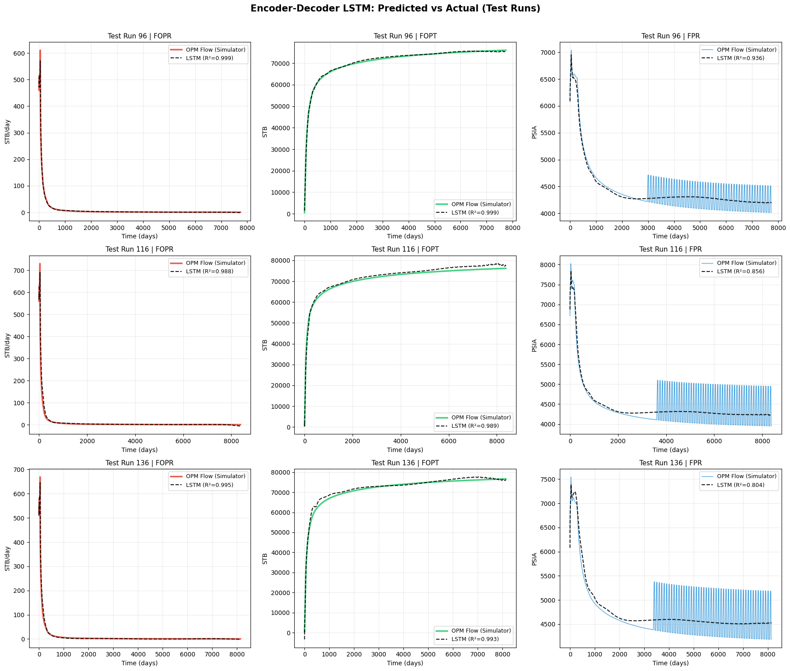

# AI-Driven Reservoir Performance Proxy
### Physics-Aware Deep Learning | ML2 Final Project — University of Chicago

> **Replace months of reservoir simulation with millisecond ML inference.**
> Given 6 geological and operational parameters, our models predict 22-year oil production, cumulative output, and reservoir pressure with R² > 0.94 across all targets.

---

## The Problem

Reservoir simulators (like OPM Flow) solve complex fluid-flow equations over millions of grid cells. A single 22-year scenario takes minutes-to-hours to run — making real-time decision-making, history matching, and economic optimization impractical.

**Our solution:** train surrogate models on 200 high-fidelity OPM Flow simulations so that the same prediction takes under 1 second.

---

## Models

| Model | Type | Predicts | Best R² |
|-------|------|----------|---------|
| **Encoder-Decoder LSTM** | Deep learning | Full 22-year time-series (8 variables) | 0.991 † |
| **MLP** | Deep learning | 4 final/peak scalar values | 0.996 |
| **PINN** | Physics-informed NN | 4 scalars with Darcy's Law enforced | 0.996 |
| **Random Forest** | Classical ML | 4 scalars (most interpretable) | 0.988 |

† Best single-variable R² (FGIT — cumulative gas injection); average R² across all 8 output variables is 0.94.

### Input Features (6 parameters)

| Parameter | Description | Example range |
|-----------|-------------|---------------|
| `producer_bhp_psi` | Producer bottom-hole pressure | 1000–5000 psi |
| `gas_inj_rate_mscf_d` | Gas injection rate | 5–100 Mscf/d |
| `inj_bhp_limit_psi` | Injector BHP ceiling | 5000–15000 psi |
| `init_prod_period_days` | Initial production period | 100–5000 days |
| `perm_multiplier` | Permeability multiplier | 0.1–10.0 |
| `poro_multiplier` | Porosity multiplier | 0.5–2.0 |

### Output Targets

| Variable | Description | Unit |
|----------|-------------|------|
| `fopr` / `fopt` | Oil production rate / Cumulative oil | STB/d, STB |
| `fpr` | Field reservoir pressure | PSIA |
| `fgpr` / `fgpt` | Gas production rate / Cumulative gas | MSCF/D, MSCF |
| `fgir` / `fgit` | Gas injection rate / Cumulative injection | MSCF/D, MSCF |
| `wbhp_inj` | Injector bottom-hole pressure | PSIA |

---

## Quickstart

### 1. Install dependencies
```bash
pip install -r requirements.txt
```

### 2a. Download pre-trained weights (recommended)
Skip retraining entirely — download all saved models with one command:
```bash
pip install huggingface_hub
python download_models.py
```
This fetches all `.keras`, `.pkl`, `.npy`, and `.json` files from HuggingFace into `saved_models/`.

### 2b. Or retrain from scratch
Run each notebook in order. Each saves trained models to `saved_models/`:
```
04_random_forest_baseline.ipynb   → saved_models/rf_*.pkl
02_mlp_proxy.ipynb                → saved_models/mlp_*.keras / .pkl
03_pinn_proxy.ipynb               → saved_models/pinn_*.keras / .pkl
01_lstm_encoder_decoder.ipynb     → saved_models/enc_dec_lstm_*.keras / .pkl / .npy
```

### 3. Run inference — command line
```bash
# Full 22-year time-series from LSTM
python predict.py --model lstm \
  --perm 1.5 --poro 1.2 --bhp 2000 \
  --inj_rate 50 --inj_bhp 8000 --init_period 365 --plot

# Compare all 4 models on scalar targets
python predict.py --model all \
  --perm 1.0 --poro 1.0 --bhp 3000 \
  --inj_rate 35 --inj_bhp 10000 --init_period 3230
```

### 4. Run inference — interactive notebook
Open `demo.ipynb`, edit the 6 parameters in Cell 1, and run all cells.

---

## Repository Structure

```
├── 01_lstm_encoder_decoder.ipynb       # Encoder-Decoder LSTM (full time-series)
├── 02_mlp_proxy.ipynb                  # MLP scalar proxy
├── 03_pinn_proxy.ipynb                 # Physics-Informed NN
├── 04_random_forest_baseline.ipynb     # Random Forest baseline
├── demo.ipynb                          # Interactive inference demo
├── predict.py                          # CLI inference script
├── download_models.py                  # Fetch weights from HuggingFace
├── requirements.txt                    # Python dependencies
├── dataset_scalar.csv                  # Dataset for MLP / PINN / RF
├── dataset_timeseries_lstm.csv         # Dataset for LSTM
├── figures/                            # Training and evaluation plots
│   ├── lstm_pred_vs_actual.png
│   ├── rf_feature_importance.png
│   ├── rf_pred_vs_actual.png
│   └── rf_residuals_by_group.png
└── saved_models/                       # Created after running notebooks
    ├── enc_dec_lstm_reservoir_proxy.keras
    ├── scaler_static.pkl / scaler_time.pkl / scaler_y.pkl
    ├── lstm_avg_time_grid.npy
    ├── mlp_reservoir_proxy.keras
    ├── mlp_scaler_X.pkl / mlp_scaler_y.pkl
    ├── pinn_base_model.keras
    ├── pinn_scaler_X.pkl / pinn_scaler_y.pkl
    └── rf_final_fopt.pkl / rf_final_fpr.pkl / rf_final_fopr.pkl / rf_peak_fopr.pkl
```

---

## How the Dataset Was Generated

We used the **SPE10 benchmark reservoir model** as our base simulation. Across 6 key parameters, we applied **Latin Hypercube Sampling** to generate 200 diverse scenarios:

- **Runs 1–100:** Operational sensitivity (isolating individual variable effects)
- **Runs 101–150:** Chaotic group (simultaneous variation for interaction capture)
- **Runs 151–200:** Geological group (permeability/porosity uncertainty)

Each scenario was simulated in **OPM Flow** producing 22 years of production data (~800 adaptive time steps per run → 158,742 total rows).

---

## Key Technical Contributions

**1. Encoder-Decoder LSTM with sentinel padding**
Static reservoir parameters are compressed into a latent "scenario fingerprint" by the Encoder; the Decoder LSTM unrolls it over adaptive time steps. Padded sequences use a −1.0 sentinel with a Keras `Masking` layer to prevent the LSTM from learning on padded steps.

**2. Weighted Huber loss for integral drift**
Standard MSE causes cumulative oil (FOPT) to drift because it doesn't enforce that cumulative = ∫ rate. We apply a 1.5× loss weight to FOPT/FGPT to correct this — R²(FOPT) improved from 0.57 to 0.965.

**3. Physics-Informed Neural Network**
Two reservoir engineering constraints are embedded directly in the training loop via a custom `GradientTape`:
- **Darcy's Law:** FPR > Producer BHP (flow cannot reverse)
- **Injection ceiling:** FPR < Injector BHP limit

Violations are penalized with Huber loss (λ = 0.01), achieving 93% physical constraint compliance (56/60 checks passed) on the test set and R²(FOPT) = 0.996.

---

## Results

| Target | LSTM R² | MLP R² | PINN R² | RF R² |
|--------|---------|--------|---------|-------|
| Oil Rate (FOPR) | 0.984 | 0.984 | 0.942 | 0.972 |
| Cumul. Oil (FOPT) | 0.965 | 0.996 | 0.996 | 0.988 |
| Reservoir Pressure (FPR) | 0.842 | 0.972 | 0.960 | 0.934 |
| Gas Injection Rate (FGIR) | 0.947 | — | — | — |
| Cumul. Gas Injection (FGIT) | 0.991 | — | — | — |

### LSTM: Predicted vs Actual (3 held-out test scenarios)



---

## Authors

Sabayna Ali · Gabe Horas · Morgan Klutzke · Mushahid Raza  
Machine Learning 2 — University of Chicago, Spring 2026

---

## Citation

If you use this work, please cite:
```
Ali, S., Horas, G., Klutzke, M., & Raza, M. (2026).
AI-Driven Reservoir Performance Proxy: Physics-Aware Deep Learning
for Surrogate Reservoir Modeling.
University of Chicago.
```
